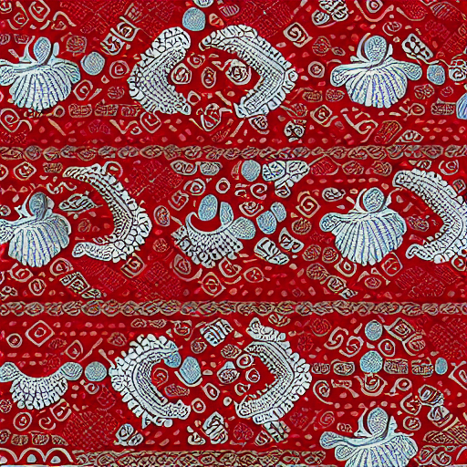
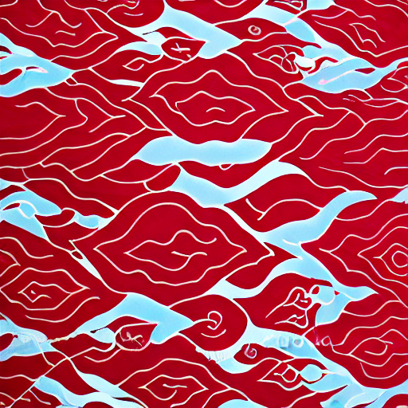

# Batik Megamendung Generation using LoRA

This repository presents an experimental study on generating **Batik Megamendung** patterns using **Stable Diffusion + LoRA (Low-Rank Adaptation)**.

The goal of this project is to:
- Adapt a general text-to-image diffusion model
- Learn a specific cultural pattern (Megamendung batik)
- Analyze LoRA behavior through qualitative experiments

---

## Experiments Overview

### 1️. Baseline (Without LoRA)
- Model: Stable Diffusion v1.5
- Prompt-based generation
- No fine-tuning

### 2️. LoRA Training
- Fine-tuned on Batik Megamendung dataset
- Lightweight adaptation using LoRA
- Base model weights frozen

### 3️. No LoRA vs LoRA Comparison
- Same prompt
- Same random seed
- Visual comparison to show LoRA effectiveness

### 4️. LoRA Strength Comparison
- LoRA scales tested: `0.5, 0.8, 1.0, 1.2`
- Observes balance between generalization and overfitting

### 5️. Seed Variation Test
- Same prompt
- Different random seeds
- Evaluates diversity vs memorization

---

## Key Findings

- LoRA successfully learns **Megamendung visual characteristics**
- Higher LoRA strength increases pattern clarity but risks overfitting
- Seed variation confirms the model does not memorize training images
- Optimal LoRA scale found around `0.8 – 1.0`

---

## Overfitting & Underfitting Analysis

| Condition | Observation |
|---------|-------------|
| Overfitting | Nearly identical outputs across different seeds |
| Underfitting | Weak or missing Megamendung patterns |
| Balanced | Consistent concept with diverse compositions |

---

## Sample Results

### Without LoRA vs With LoRA
*(Same prompt, same seed)*

| Without LoRA | With LoRA |
|-------------|-----------|
|  |  |

---

## ⚙️ Setup

```bash
pip install -r requirements.txt
