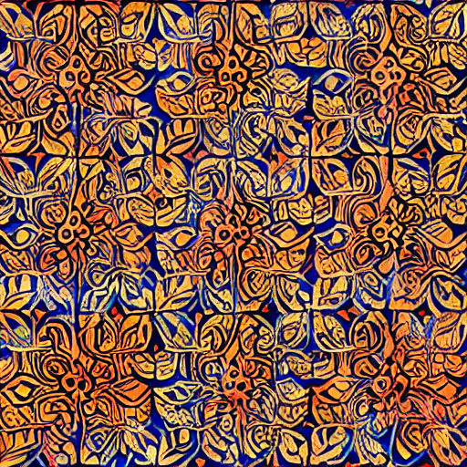

# Baseline Result (No LoRA)

This folder contains images generated using the base model **without** any additional LoRA weights. This serves as the "Control Group" for the experiment.

### Objective
To evaluate the pre-trained model's inherent knowledge of the "Batik Megamendung" pattern.

### Experiment Setup
- **Base Model:** Stable Diffusion v1.5
- **Prompt:** `"traditional batik megamendung","modern batik megamendung textile","minimalist megamendung pattern"`
- **Inference Steps:** 30
- **Guidance Scale (CFG):** 7.5

### Key Findings & Analysis
* **Pattern Recognition Failure:** The base model fails to identify the specific "cloud-like" (Megamendung) geometry. 
* **Generic Outputs:** Instead of the distinctive tiered cloud shapes, the model produces generic floral or abstract batik-style textures.
* **Conclusion:** The pre-trained Stable Diffusion v1.5 does not have sufficient internal representation of this specific Indonesian cultural heritage, justifying the need for fine-tuning via LoRA.

Outputs:

cukup pakai:

